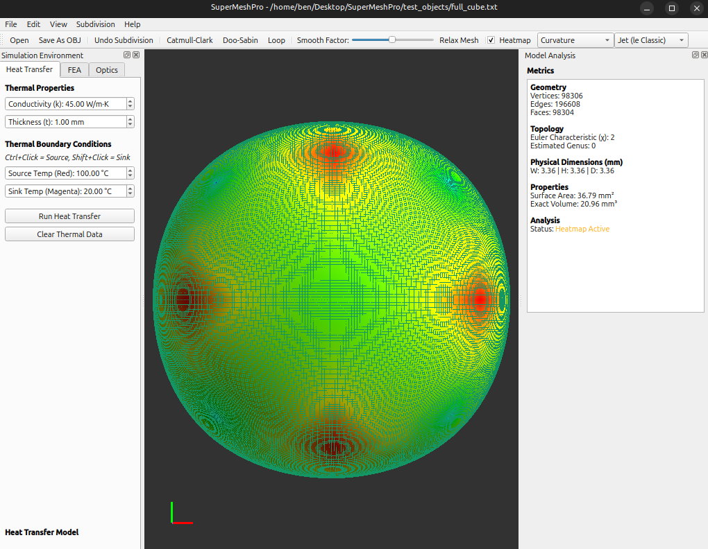

```text
  ____                         __  __           _      ____             
 / ___| _   _ _ __   ___ _ __|  \/  | ___  ___| |__  |  _ \ _ __ ___  
 \___ \| | | | '_ \ / _ \ '__| |\/| |/ _ \/ __| '_ \ | |_) | '__/ _ \ 
  ___) | |_| | |_) |  __/ |  | |  | |  __/\__ \ | | ||  __/| | | (_) |
 |____/ \__,_| .__/ \___|_|  |_|  |_|\___||___/_| |_||_|   |_|  \___/ 
             |_|
```
SuperMeshPro is a unified C++ framework designed to bridge the gap between topological subdivision modeling and robust numerical simulation. Built for precision and optimized for interactive workflows, it handles highly complex structures with ease.

---

## Features

* Advanced Subdivision & Smoothing: Catmull-Clark, Doo-Sabin, and Loop subdivision methods, and Laplacian smoothing.
* Robust Numerical Simulation: Nonlinear 6-DOF shell Finite Element Analysis (FEA) and steady state heat transfer modules.
* Ray Tracing: Ray tracing capabilities for high-quality visualization and processing.
* High-Performance Computation: OpenMP and Eigen library for rapid implementation.

---

## Installation

You can install SuperMeshPro by either downloading the pre-packaged Debian build or compiling directly from source.

### Option A: Install via .deb (Recommended for Debian/Ubuntu)
Head over to the **Releases** section of this repository and download the latest `.deb` file. Install it using:

```bash
sudo apt install ./SuperMeshPro_0.1.0_amd64.deb
```
This will automatically place the executable in your system path and create a desktop shortcut.

### Option B: Compile from Source

```bash
# Install required dependencies
sudo apt update
sudo apt install build-essential qt5-qmake qtbase5-dev \
                 libqt5widgets5 libqt5gui5 libqt5core5a \
                 libqt5opengl5-dev libeigen3-dev
```
Clone the repository and run the following build commands:

```bash
mkdir -p build_tmp
cd build_tmp
qmake ../SuperMeshPro.pro
make -j$(nproc)
```

Once compiled, you can run the binary directly from the build directory:

```bash
./SuperMeshPro
```

## SuperMeshPro User Manual

Welcome to SuperMeshPro! This software provides an intuitive graphical interface to take raw 3D meshes, refine them using industry-standard topological subdivisions, and run multi-physics simulations directly on the resulting geometry. 

Whether you're looking to run a structural FEA test on a bracket, analyze how heat moves through a plate, or bounce a swarm of lasers around a custom shape, this guide will walk you through the essential steps.

---

### 1. Getting Started: The User Interface

When you launch SuperMeshPro, you'll be greeted by a central 3D viewport and several control docks.

* **The Viewport (Center):** This is where your 3D mesh lives. You can rotate, pan, and zoom to inspect your model from any angle.
* **The Top Toolbar:** Contains quick actions for mesh manipulation, display modes (wireframe, solid, points), and color options.
* **Model Analysis Dock (Right side):** A read-only panel that instantly updates with geometric stats (volume, surface area, vertex count) every time you load or modify a mesh.
* **Simulation Environment Dock (Left side):** This is your control center for running physics. It contains tabs for **FEA** (Finite Element Analysis), **Optics** (Ray Tracing), and **Heat Transfer**.

---

### 2. Loading and Modifying a Mesh

Before you can run a simulation, you need a model.

#### Importing a Mesh
1.  Go to `File` > `Open`.
2.  Select a standard `.obj` file or a SuperMeshPro custom `.txt` format file. Feel free to load some of our test objects located under `test_objects` directory.
3.  The mesh will automatically load, center itself in the viewport, and scale to fit perfectly on screen. (Note when you load a model make sure to zoom out with mouse scroll to see it)

#### Refining and Smoothing the Mesh
Low-poly meshes can cause blocky physics results. SuperMeshPro includes built-in subdivision tools to increase the resolution and smoothness of your model.

* **Subdivision:** In the top menu bar, click `Algorithms`. You can apply **Catmull-Clark** (best for quads), **Doo-Sabin** (good for boxy, flat results), or **Loop** (best for triangles). Each click subdivides the mesh further.
* **Relaxing:** If your mesh has harsh, jagged points, use the **Smooth Factor** slider in the top toolbar and click `Relax Mesh`. This uses Laplacian smoothing to so called "melt" harsh edges away without adding extra polygons.
* *Oh no!* I made a mistake? Don't worry Just hit `Edit` > `Undo` (or Ctrl+Z) to step back through your mesh history.

---

### 3. Running a Heat Transfer Simulation

Want to see how thermal energy moves through your part? The **Heat Transfer** tab uses steady state conduction to build a temperature map.

#### Step 1: Set Material Properties
In the Simulation Environment dock, select the **Heat Transfer** tab. Set the thermal conductivity ($k$) and the material thickness. (e.g., 45 W/m·K).

#### Step 2: Apply Boundary Conditions
You need to tell the software where the heat is coming from (Source) and where it is going (Sink). 
1.  Set the temperatures you want for the Source and Sink in the UI boxes.
2.  In the 3D viewport, hold **Ctrl + Left Click** on a vertex to apply the **Source Temperature** (the dot will turn Red). Note: Toggle Vertices must be on, tick it in View tab or hit Ctrl+v
3.  Hold **Shift + Left Click** on a vertex to apply the **Sink Temperature** (the dot will turn Magenta). Note: Toggle Vertices must be on, tick it in View tab or hit Ctrl+v

#### Step 3: Run and Visualize
Click **Run Heat Transfer**. 
The mesh will instantly colorize, updating the top toolbar to show a "Temperature" heatmap. The raw data is also automatically exported to a `.csv` file in your directory.

---

### 4. Running a Structural FEA Simulation

The **FEA** tab lets you bend and stress test your mesh using a non-linear 6-DOF shell solver.

#### Step 1: Set Material Properties
Navigate to the **FEA** tab. Input your material's Young's Modulus ($E$), Poisson's Ratio ($\nu$), thickness, and density. 

#### Step 2: Define Loads and Constraints
Just like the thermal tab, you need to anchor the model and apply a force.
1.  In the 3D viewport, hold **Ctrl + Left Click** to lock vertices in place (Anchors = Red dots). These vertices will not move. Note: Toggle Vertices must be on, tick it in View tab or hit Ctrl+v
2.  Hold **Shift + Left Click** to select the vertices you want to pull (Loads = Magenta dots). Note: Toggle Vertices must be on, tick it in View tab or hit Ctrl+v
3.  In the UI, set the **Total Force** (in Newtons) and select which axis (X, Y, or Z) you want the force to push/pull along.

#### Step 3: Configure Physics Engine
You can optionally check the box to **Enable Gravity**, which will pull the entire mesh downwards along the -Y axis based on the material density you provided. You can also enable **Non-Linear Geometry**, which tells the solver to take multiple steps to calculate large, complex bends accurately.

#### Step 4: Run and Visualize
Click **Run FEA Simulation**. 
The mesh in the viewport will physically deform based on the forces applied. You can exaggerate this bending by changing the "Deform Scale" value. The colors on the mesh now represent the Von Mises stress (Red = high stress, Blue = low stress).

---

### 5. Running an Optics (Ray Tracing) Simulation

The **Optics** tab allows you to simulate an optical beam swarm bouncing off the surfaces of your model. 

#### Step 1: Position the Laser
In the UI, set the **Beam Origin** (X, Y, Z coordinates). This is where the beam pointer is standing in 3D space.

#### Step 2: Aim the Laser
Set the **Yaw** (left/right rotation) and **Pitch** (up/down rotation) angles to aim the beam at your mesh.

#### Step 3: Configure the Beam
* **Max Bounce Cutoff:** How many times a ray is allowed to reflect before the simulation kills it.
* **Ray Count:** How many individual rays to shoot in the swarm.
* **Beam Spread:** How wide the beam is (in degrees). A 0 deg spread is a perfect pointer; a 45 deg spread is more like a flashlight.
* **Reflectivity:** How shiny the mesh surface is (0.0 absorbs all light, 1.0 reflects it perfectly).

#### Step 4: Fire!
Click **Run Particle Transport**. 
Neon green lines will appear in the viewport, mapping the exact paths of the rays as they scatter off the mesh. The mesh itself will colorize based on where the optical energy was absorbed! 

*(Note: Ray tracing is computationally heavy! Shooting 100,000 rays with 50 bounces may take a few moments -- I tested this on my AMD Ryzen Threadripper 9960X and it can handle it well).*

## Screenshot



## Figshare DOI

Link: https://doi.org/10.6084/m9.figshare.31672789

## License
SuperMeshPro is completely free and open-source software licensed under the GNU General Public License v3.0 (GPLv3).
